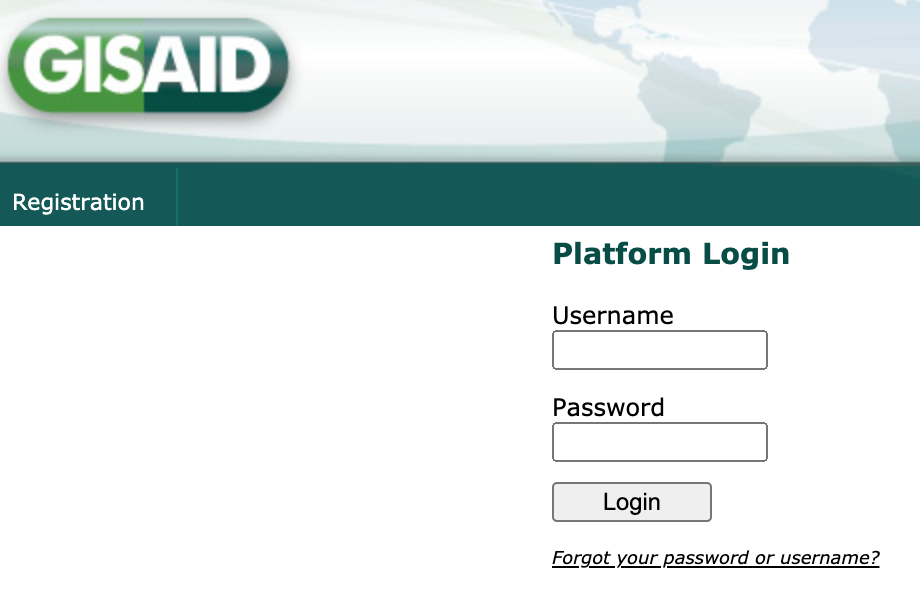
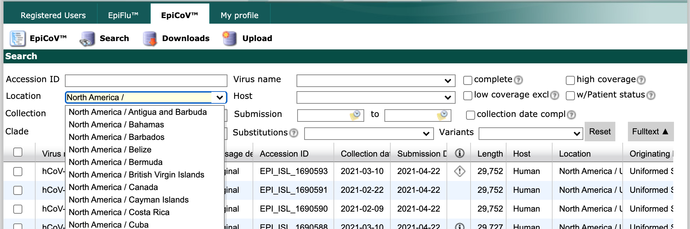
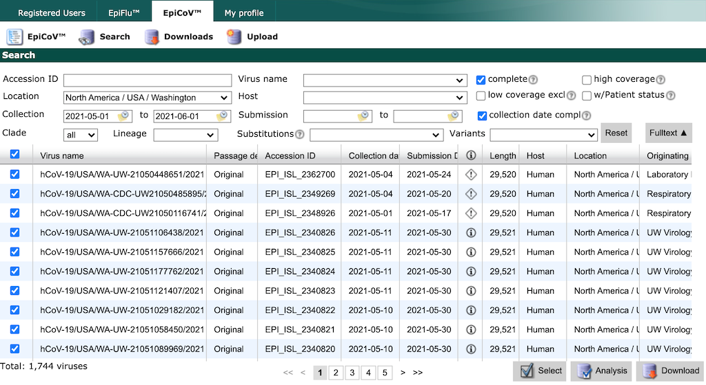
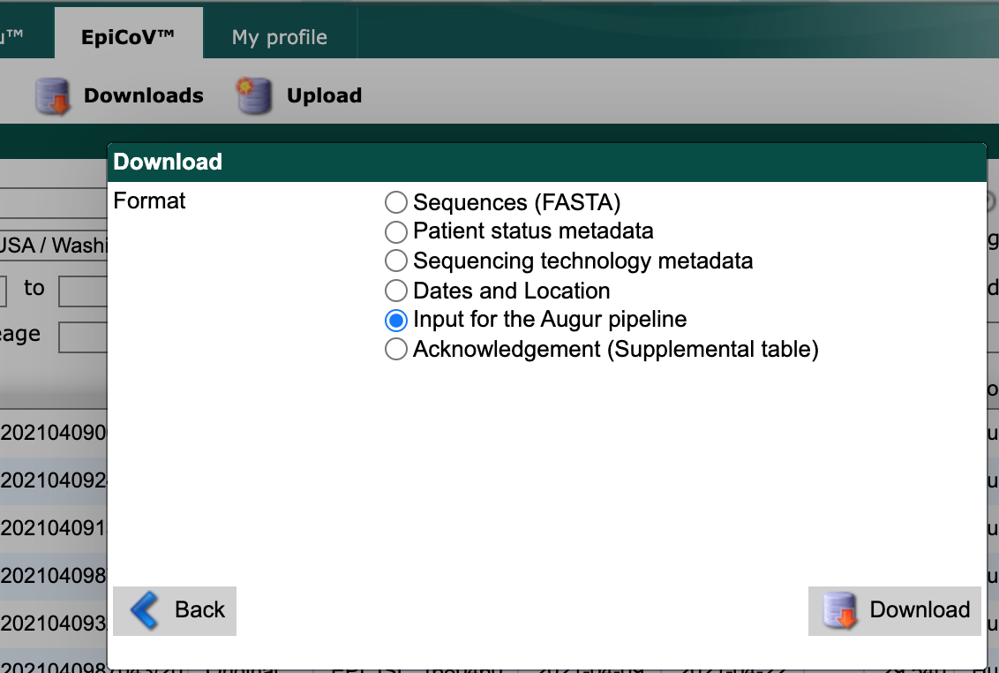
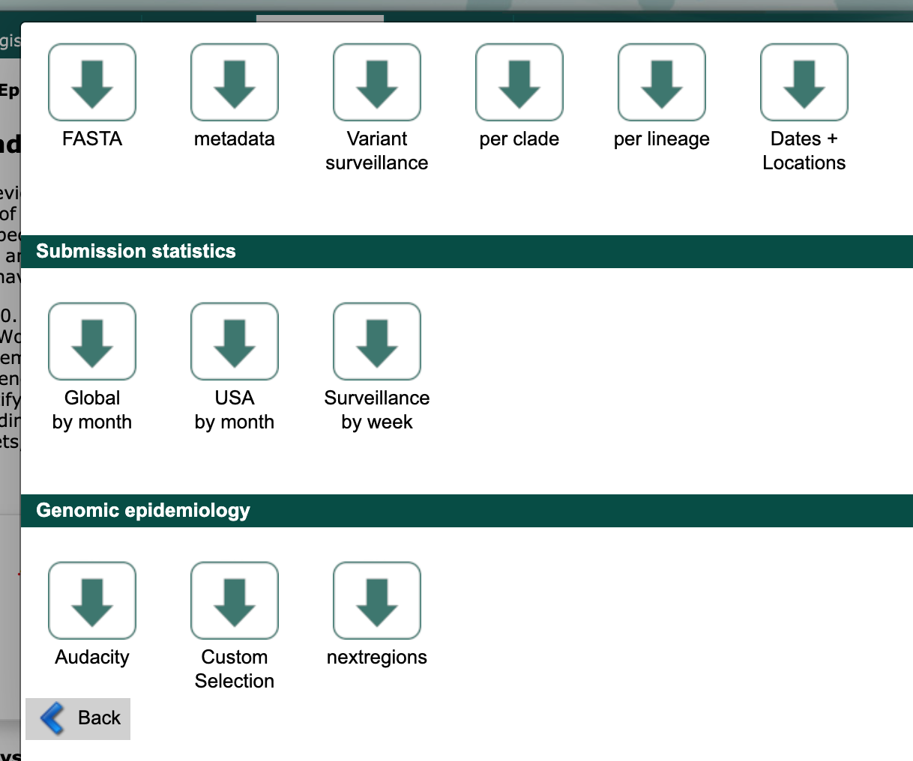
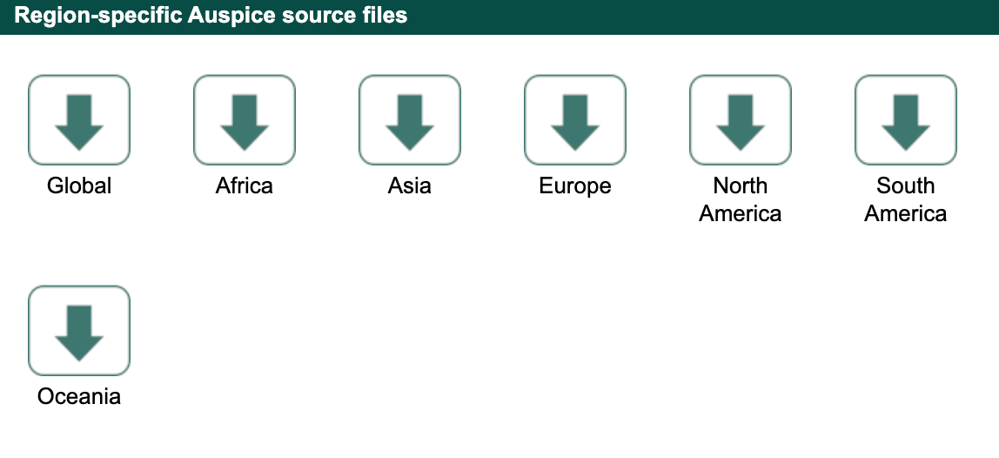
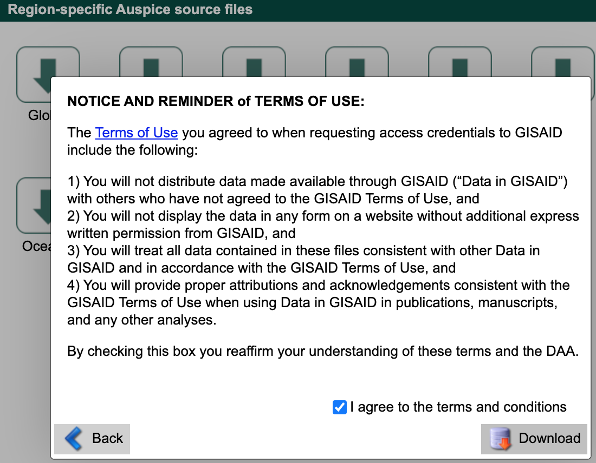

# Preparing your data
<!-- WARNING -->
<!-- Do not edit this file from within the docs.nextstrain.org repository. -->
<!-- It is fetched from another repository to be included in the docs.nextstrain.org build. -->
<!-- So, if you edit it after it is fetched into docs.nextstrain.org, your changes will be lost. -->
<!-- Instead, edit this file in its own repository and commit your changes there. -->
<!-- For more details on this (temporary) implementation, see https://github.com/nextstrain/docs.nextstrain.org#fetching-of-documents-from-other-repositories -->
<!-- This file is fetched from: https://github.com/nextstrain/ncov/blob/master/docs/data-prep.md -->
<!-- WARNING -->
<!-- WARNING -->
<!-- WARNING -->

<p style="color: #055160; background-color: #cff4fc; border-color: #b6effb; padding: 1em; border-radius: .25rem;">
We've prepared an example dataset in the `data` directory.
If you'd like to move ahead with this tutorial with this example dataset, [skip to the next section](orientation-workflow.md).
If you'd like to prepare your own data, read on.
</p>

To use Nextstrain to analyze your own data, you'll need to prepare two files:

1. A `fasta` file with viral genomic sequences
2. A corresponding `tsv` file with metadata describing each sequence

We describe the following ways to prepare data for a SARS-CoV-2 analysis:

1. <a href="#prepare-your-own-local-data">Prepare your own local data</a> for quality control prior to submission to a public database.
1. <a href="#curate-data-from-gisaid-search-and-downloads">Curate data from GISAID search and downloads</a> to prepare a regional analyses based on local sequences identified through GISAID's search interface and contextual sequences for your region from GISAID's "nextregions" downloads.
1. <a href="#curate-data-from-the-full-gisaid-database">Curate data from the full GISAID database</a> to prepare a custom analysis by downloading the full database and querying for specific strains locally with [Augur](https://docs.nextstrain.org/projects/augur/en/stable/index.html).

## Prepare your own local data

### Formatting your sequence data

The first 2 lines in `data/sequences.fasta` look like this:
```
>Wuhan-Hu-1/2019
ATTAAAGGTTTATACCTTCCCAGGTAACAAACCAACCAACTTTCGATCTCTTGTAGATC.....
```
**The first line is the `strain` or `name` of the sequence.**
Lines with names in FASTA files always start with the `>` character (this is not part of the name), and may not contain spaces or `()[]{}|#><`.
Note that "strain" here carries no biological or functional significance and should largely be thought of as synonymous with "sample."

The sequence itself is a **[consensus genome](https://en.wikipedia.org/wiki/Consensus_sequence#:~:text=In%20molecular%20biology%20and%20bioinformatics,position%20in%20a%20sequence%20alignment.)**.

**By default, sequences less than 27,000 bases in length or with more than 3,000 `N` (unknown) bases are omitted from the analysis.**
For a basic QC and preliminary analysis of your sequence data, you can use [clades.nextstrain.org](https://clades.nextstrain.org/).
This tool will check your sequences for excess divergence, clustered differences from the reference, and missing or ambiguous data. In addition, it will assign nextstrain clades and call mutations relative to the reference.

### Formatting your metadata

Nextstrain accommodates many kinds of metadata, so long as it is in a `TSV` format.
A `TSV` is a text file, where each row (line) represents a sample and each column (separated by tabs) represents a field.

>If you're unfamiliar with TSV files, don't fret; it's straightforward to export these directly from Excel, which we'll cover shortly.

Here's an example of the first few columns of the metadata for a single strain, including the header row.
_(Spacing between columns here is adjusted for clarity, and only the first 6 columns are shown)._
```
strain              virus  gisaid_epi_isl  genbank_accession   date        region   ...
NewZealand/01/2020  ncov   EPI_ISL_413490  ?                   2020-02-27  Oceania  ...
```

[See the reference guide on metadata fields for more details](metadata-fields.md).

#### Required metadata

A valid metadata file must include the following fields:

| Field | Example value | Description | Formatting |
|---|---|---|---|
|`strain` or `name`| `Australia/NSW01/2020` | Sample name / ID | Each header in the fasta file must exactly match a `strain` value in the metadata. Characters `()[]{}|#><` are disallowed |
|`date` | `2020-02-27`, `2020-02-XX`, `2020-XX-XX` | Date of _sampling_ | `YYYY-MM-DD`; ambiguities can be indicated with `XX`|
|`virus`|`ncov`|Pathogen name|Needs to be consistent|
|`region`|`Africa`, `Asia`, `Europe`, `North America`, `Oceania` or `South America`|Global region of _sampling_ ||

Please be aware that **our current pipeline will filter out any genomes with an unknown date - you can change this in your own pipeline.**

#### Missing metadata

Missing data is to be expected for certain fields.
In general, **missing data is represented by an empty string or a question mark character.**
There is one important difference: if a discrete trait reconstruction (e.g. via `augur traits`) is to be run on this column, then a value of `?` will be inferred, whereas the empty string will be treated as missing data in the output. See below for how to represent uncertainty in sample collection date.

#### General formatting tips

- **The _order_ of the fields doesn't matter**; but if you are going to join your metadata with the global collection then it's easiest to keep them in the same order!
- **Not all fields are currently used**, but this may change in the future.
- Data is **case sensitive**
- The **"geographic" columns, such as "region" and "country" will be used to plot the samples on the map**.
Adding a new value to these columns isn't a problem at all, but there are a few extra steps to take; see the [customization guide](customizing-analysis.md).
- **You can color by any of these fields in the Auspice visualization**. Which exact columns are used, and which colours are used for each value is completely customisable; see the [customization guide](customizing-visualization.md).

#### Formatting metadata in Excel

You can also create a TSV file in Excel.
However, due to issues with auto-formatting of certain fields in Excel (like dates), we don't recommend this as a first option.
If you do edit a file in Excel, open it afterwards in a text editor to check it looks as it should.

1. Create a spreadsheet where each row is a sample, and each column is a metadata field
2. Ensure your spreadsheet meets the requirements outlined above. Pay special attention to date formats; see [this guide to date formatting in Excel](https://support.microsoft.com/en-us/office/format-a-date-the-way-you-want-8e10019e-d5d8-47a1-ba95-db95123d273e?ui=en-us&rs=en-us&ad=us).
3. Click on `File > Save as`
4. Choose `Text (Tab delimited) (*.txt)` and enter a filename ending in `.tsv`

## Curate data from GISAID search and downloads

The following instructions describe how to curate data for a region-specific analysis (e.g., identifying recent introductions into Washington State) using GISAID's "Search" page and curated regional data from the "Downloads" window.
Inferences about a sample's origin strongly depend on the composition of your dataset.
For example, discrete trait analysis models cannot infer transmission from an origin that is not present in your data.
We show how to overcome this issue by adding previously curated contextual sequences from Nextstrain to your region-specific dataset.

### Login to GISAID

Navigate to [GISAID (gisaid.org)](https://www.gisaid.org/) and select the "Login" link.


Login to your GISAID account.
If you do not have an account yet, register for one (it's free) by selecting the "Registration" link.



Select "EpiCoV" from the top navigation bar.


### Search for region-specific data

Select "Search" from the EpiCoV navigation bar.


Find the "Location" field and start typing "North America /".
As you type, the field will suggest more specific geographic scales.



Finish by typing "North America / USA / Washington".
Select all strains collected between May 1 and June 1 with complete genome sequences and collection dates.
Click the checkbox in the header row of the results display, to select all strains that match the search parameters.



<p style="color: #212529; background-color: #ffc107; border-color: #b6effb; padding: 1em; border-radius: .25rem;">
GISAID limits the number of records you can download at once to 5000.
If you need to download more records, constrain your search results to smaller windows of time by collection date and download data in these smaller batches.
</p>

Select the "Download" button in the bottom right of the search results.
From the resulting "Download" window, select "Input for the Augur pipeline" as the download format.



Select the "Download" button and save the resulting file (named like `gisaid_auspice_input_hcov-19_2021_06_01_17.tar`) to the `data/` directory.
This tar archive contains compressed metadata and sequences named like `1622567829294.metadata.tsv.xz` and `1622567829294.sequences.fasta.xz`, respectively.
You can use this tar file as an input for the Nextstrain workflow, as shown below, and let the workflow extract the data for you.

```yaml
# Define inputs for the workflow.
inputs:
  - name: washington
    # The workflow will detect and extract the metadata and sequences
    # from GISAID tar archives.
    metadata: data/gisaid_auspice_input_hcov-19_2021_06_01_17.tar
    sequences: data/gisaid_auspice_input_hcov-19_2021_06_01_17.tar
```

Alternately, you can extract these files into the `data/` directory prior to analysis.

```bash
tar xvf data/gisaid_auspice_input_hcov-19_2021_06_01_17.tar
```

You can use these extracted files as inputs for the workflow.

```yaml
# Define inputs for the workflow.
inputs:
  - name: washington
    # The workflow also accepts compressed metadata and sequences
    # from GISAID.
    metadata: data/1622567829294.metadata.tsv.xz
    sequences: data/1622567829294.sequences.fasta.xz
```

### Download contextual data for your region of interest

Next, select the "Downloads" link from the EpiCoV navigation bar.


Scroll to the "Genomic epidemiology" section and select the "nextregions" button.



Select the major region that corresponds to your region-specific data above (e.g., "North America").



Agree to the terms and conditions and download the corresponding file (named like `ncov_north-america.tar.gz`) to the `data/` directory.



This compressed tar archive contains metadata and sequences corresponding to [a recent Nextstrain build for that region](https://nextstrain.org/sars-cov-2).
For example, the "North America" download contains data from [Nextstrain's North America build](https://nextstrain.org/ncov/north-america).
These regional Nextstrain builds contain data from a specific region and contextual data from all other regions in the world.

## Curate data from the full GISAID database

## Contextualizing your data

### Background / contextual sequences

Making inferences about a sample's origin is strongly dependent on the makeup of your dataset: the model can't infer a transmission from an origin it doesn't have any (or enough) data from.

To address this, we strongly recommend adding contextual background sequences to your dataset. To make this easier, we provide a continually-updated dataset, pre-formatted for Nextstrain, through [GISAID](https://gisaid.org). To download this dataset:

1. Register for a GISAID account if you don't have one already and then log into GISAID's EpiCoV database.
2. Click "Downloads" to bring up a modal window.
3. If you scroll down to the bottom of this modal window you should see a heading of "Genomic epidemiology" that includes entries "FASTA" and "metadata".
4. Click on "metadata" to download a compressed file of the form `metadata_2021-04-08_08-30.tsv.gz`. Uncompress this file and save as `data/gisaid_metadata.tsv`.
5. Click on "FASTA" to download a compressed file of the form `sequences_2021-04-08_08-30.fasta.gz`. Keep this file compressed and save as `data/gisaid_sequences.fasta.gz`.


GISAID maintains multiple tiers of access and many users of GISAID will initially lack access to the "FASTA" and "metadata" under "Genomic epidemiology" (the entries will just be absent). If you find that these files are missing for you, you'll need to email GISAID at hCoV-19@gisaid.org to request access to the specific "FASTA" and "metadata" files under "Genomic epidemiology". Somewhat confusingly, there are separate "FASTA" and "metadata" entries listed under the heading "Download packages". These files are a slightly different format and are not directly compatible with the Nextstrain ncov pipeline. Please feel free to let us know at [discussion.nextstrain.org](https://discussion.nextstrain.org/t/nextmeta-and-nextfasta-not-on-gisaid/224) if you're having difficulties accessing these files.

The Nextstrain team uses this pipeline to include the latest sequences and metadata from GISAID in our builds: [nextstrain/ncov-ingest](https://github.com/nextstrain/ncov-ingest).

### Subsampling

We've outlined several methods for subsampling, including builds with a focus area and genetically similar contextual sequences, in the [section on customizing your analysis](customizing-analysis.md#subsampling).

## [Previous Section: Setup and installation](setup.md)
## [Next Section: Orientation: workflow](orientation-workflow.md)
